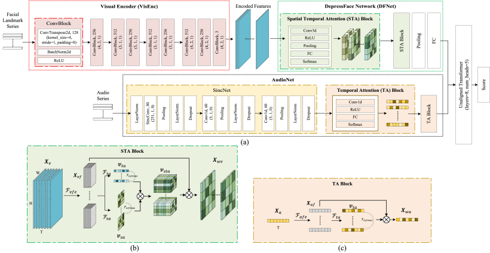
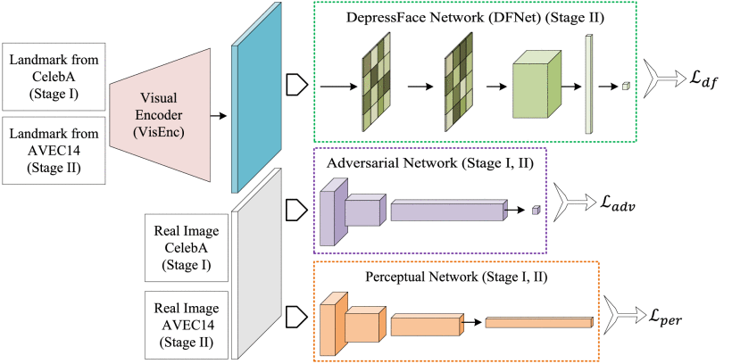

# AVA-DepressNet

Code for paper 'Integrating Deep Facial Priors Into Landmarks for Privacy Preserving Multimodal Depression Recognition'

IEEE Transactions on Affective Computing, [http://dx.doi.org/10.1109/TAFFC.2023.3296318](http://dx.doi.org/10.1109/TAFFC.2023.3296318)

|  |  |
| ------------------------------- | ------------------------------- |

1: Using the scripts in `preprocess` folder to process the datasets. 

2: Fill the datasets in `dataset` folder with your datasets.

3: Train the AMS stage with `train_sX_wgan.py`. 

4: Finetune the model with `STA_TA_XX.py` on the AVEC datasets.

5: Get the visualization results with `vis_STA_XX.py`.

Citation:
```
@ARTICLE{10185131,
author={Pan, Yuchen and Shang, Yuanyuan and Shao, Zhuhong and Liu, Tie and Guo, Guodong and Ding, Hui},
journal={IEEE Transactions on Affective Computing}, 
title={Integrating Deep Facial Priors Into Landmarks for Privacy Preserving Multimodal Depression Recognition}, 
year={2024},
volume={15},
number={3},
pages={828-836},
keywords={Depression;Feature extraction;Face recognition;Visualization;Training;Image recognition;Deep learning;Depression recognition;multimodal;spatial-temporal attention;video recognition},
doi={10.1109/TAFFC.2023.3296318}}
```
